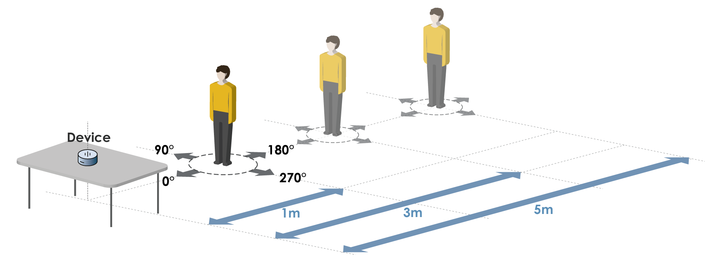
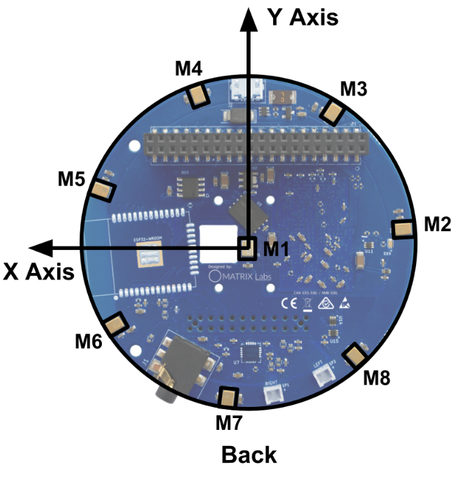

# Database for Call Detection using Prosody
This is the research repository for **Aware: Intuitive Device Activation Using Prosody for Natural Voice Interactions (CHI 2022)**. It contains the the database. 

Link to the dataset: [Dropbox](https://www.dropbox.com/s/969ldu4acl0ubus/aware_prosody_dataset.tar.gz?dl=0)

## Dataset Description



The data is organized in the following manner:

* 11 participants (p1 to p11)
* 3 keywords (Alexa, Assistant and Computer)
* 6 sentences (see Table 1)
* 4 user directions (0°, 90°, 180°, 270°)
* 3 user distances (1m, 3m and 5m)
* 5 repeats
* 8 recording channels



Therefore, this dataset consists of 11 x 3 x 6 x 4 x 3 x 5 x 8 = 95040 individual recording samples.

The recording system is implemented by attaching a [MATRIX Voice Mic Array](https://www.matrix.one/products/voice) onto the GPIO pins of a [Raspberry Pi 4B](https://www.raspberrypi.com/products/raspberry-pi-4-model-b/). The mic array records audio with 8 channels at 16kHz sampling frequency. The distribution of the mic array is shown to the right.

The directory is organized as follows:

* ParticipantID /
  * Keyword /
    * Sentence_No. /
      * KeywordID_Direction_Facing_Sentence_Calling_Distance_ChannelNum_VADIdx.wav


Specifically, \
KeywordID ∈ [1, 2, 3]
Direction ∈ [0, 1, 2, 3] -> [0°, 90°, 180°, 270°]\
Facing = 1 if Direction == 0 else 0\
Sentence ∈ [1, 2, 3, 4, 5, 6] -> [sen_1, sen_2, sen_3, sen_4, sen_5, sen_6]\
Calling = 1 if Sentence ∈ [1, 2, 3] else 0\
Distance = ∈ [1, 2, 3] -> [1m, 3m, 5m]\
VADIdx refers to the number of times the user uttered in the experiment (e.g., VAD_Idx = 1 means the first utterance, 2 means the 2nd utterance..., etc.). This is determined from the Audacity's Voice Acitivity Detection (VAD) log.


<!-- ## Reference
Xinlei Zhang, Zixiong Su, and Jun Rekimoto. 2022.  Aware: Intuitive Device Activation Using Prosody for Natural Voice Interactions (CHI '22). DOI:https://doi.org/10.1145/3491102.3517687. -->


## Disclaimer

```
THE PROGRAM IS DISTRIBUTED IN THE HOPE THAT IT WILL BE USEFUL, BUT WITHOUT ANY WARRANTY. IT IS PROVIDED "AS IS" WITHOUT WARRANTY OF ANY KIND, EITHER EXPRESSED OR IMPLIED, INCLUDING, BUT NOT LIMITED TO, THE IMPLIED WARRANTIES OF MERCHANTABILITY AND FITNESS FOR A PARTICULAR PURPOSE. THE ENTIRE RISK AS TO THE QUALITY AND PERFORMANCE OF THE PROGRAM IS WITH YOU. SHOULD THE PROGRAM PROVE DEFECTIVE, YOU ASSUME THE COST OF ALL NECESSARY SERVICING, REPAIR OR CORRECTION.

IN NO EVENT UNLESS REQUIRED BY APPLICABLE LAW THE AUTHOR WILL BE LIABLE TO YOU FOR DAMAGES, INCLUDING ANY GENERAL, SPECIAL, INCIDENTAL OR CONSEQUENTIAL DAMAGES ARISING OUT OF THE USE OR INABILITY TO USE THE PROGRAM (INCLUDING BUT NOT LIMITED TO LOSS OF DATA OR DATA BEING RENDERED INACCURATE OR LOSSES SUSTAINED BY YOU OR THIRD PARTIES OR A FAILURE OF THE PROGRAM TO OPERATE WITH ANY OTHER PROGRAMS), EVEN IF THE AUTHOR HAS BEEN ADVISED OF THE POSSIBILITY OF SUCH DAMAGES.
```
